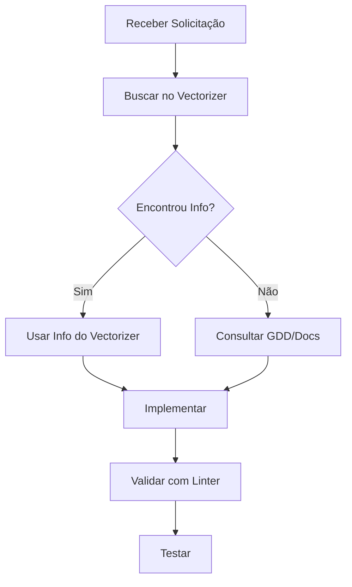

# 🤖 AGENTS.md - Instruções para Agentes de IA

## 📋 Instruções Gerais

Este documento contém diretrizes para agentes de IA (como Cursor AI, GitHub Copilot, Claude, etc.) que trabalham neste projeto **Beast Keepers**.

---

## 🎯 Prioridade de Fontes de Informação

### 1️⃣ **PRIORIDADE MÁXIMA: Vectorizer MCP**

**SEMPRE use o Vectorizer como fonte primária de dados através do MCP (Model Context Protocol) do Cursor.**

#### Como usar o Vectorizer:

```
# Buscar informações no Vectorizer
Use a ferramenta MCP do Vectorizer para:
- Buscar documentação do projeto
- Entender arquitetura e padrões
- Consultar implementações existentes
- Verificar convenções de código
```

#### Quando usar:
- ✅ **SEMPRE** antes de criar novos arquivos
- ✅ **SEMPRE** antes de modificar sistemas existentes
- ✅ **SEMPRE** antes de responder dúvidas sobre o projeto
- ✅ **SEMPRE** antes de implementar novas features
- ✅ **SEMPRE** para entender o contexto completo

#### Ferramentas MCP disponíveis:
- `mcp_vectorizer_search_vectors` - Busca semântica em coleções
- `mcp_vectorizer_intelligent_search` - Busca inteligente com expansão de domínio
- `mcp_vectorizer_semantic_search` - Busca semântica avançada
- `mcp_vectorizer_discover` - Pipeline completo de descoberta
- `mcp_vectorizer_get_file_content` - Obter conteúdo de arquivo indexado
- `mcp_vectorizer_list_files_in_collection` - Listar arquivos de uma coleção

---

### 2️⃣ **Fontes Secundárias (em ordem de prioridade):**

1. **GDD.md** - Game Design Document (regras de jogo, mecânicas, lore)
2. **ARCHITECTURE.md** - Arquitetura do projeto
3. **README.md** - Visão geral e quick start
4. **Código-fonte existente** - Sempre verificar implementações atuais
5. **Documentos técnicos** (SISTEMA_*.md)

---

## 🔍 Workflow Recomendado

### Ao receber uma solicitação:



### Exemplo Prático:

**❌ NÃO FAZER:**
```
Usuário: "Adicione um novo sistema de combate"
Agente: *Cria código do zero sem consultar nada*
```

**✅ FAZER:**
```
Usuário: "Adicione um novo sistema de combate"
Agente: 
1. Buscar no Vectorizer: "sistema de combate existente"
2. Consultar GDD.md para regras de combate
3. Ler src/systems/combat.ts
4. Entender padrões existentes
5. Implementar seguindo os padrões encontrados
```

---

## 📚 Coleções Vectorizer Disponíveis

### Principais coleções para consulta:

- **`vectorizer-source`** - Código-fonte do Vectorizer
- **`vectorizer-docs`** - Documentação do Vectorizer
- **`beast-keepers-source`** - Código-fonte do Beast Keepers (este projeto)
- **`beast-keepers-docs`** - Documentação do Beast Keepers

---

## 🎮 Convenções do Projeto Beast Keepers

### Padrões de Código:

1. **TypeScript Strict Mode** - Sempre tipado
2. **ES6 Modules** - Nunca usar `require()`
3. **Async/Await** - Para operações assíncronas
4. **Error Handling** - Sempre com try/catch
5. **Naming**:
   - Funções: `camelCase`
   - Classes: `PascalCase`
   - Constantes: `SCREAMING_SNAKE_CASE`
   - Arquivos: `kebab-case.ts`

### Estrutura de Arquivos:

```
src/
├── systems/        # Lógica de negócio
├── ui/            # Interfaces de usuário
├── data/          # Dados estáticos
├── utils/         # Utilitários
└── types.ts       # Tipos globais
```

---

## 🚨 Regras Críticas

### ⚠️ NUNCA FAÇA:

1. ❌ **Inventar informações** - Sempre consulte Vectorizer/Docs
2. ❌ **Usar `require()`** - Use `import` (ES6 modules)
3. ❌ **Quebrar funcionalidades existentes** - Sempre teste
4. ❌ **Ignorar tipos TypeScript** - Sempre tipado
5. ❌ **Criar arquivos .md de debug** - Use o Vectorizer para contexto
6. ❌ **Modificar GDD.md sem autorização** - É o documento mestre
7. ❌ **Usar definições erradas das Bestas** - Sempre consulte GDD.md

### ✅ SEMPRE FAÇA:

1. ✅ **Consultar Vectorizer primeiro**
2. ✅ **Ler código existente antes de modificar**
3. ✅ **Validar com linter** (`read_lints`)
4. ✅ **Testar mudanças**
5. ✅ **Seguir padrões existentes**
6. ✅ **Manter funcionalidades antigas ao adicionar novas**
7. ✅ **Fazer commits descritivos**

---

## 🔧 Ferramentas Disponíveis

### Cursor Tools:

- `codebase_search` - Busca semântica no código
- `grep` - Busca por texto exato
- `read_file` - Ler arquivos
- `search_replace` - Modificar arquivos
- `run_terminal_cmd` - Executar comandos
- `read_lints` - Verificar erros de lint

### MCP Vectorizer:

- `mcp_vectorizer_search_vectors` - Busca básica
- `mcp_vectorizer_intelligent_search` - Busca inteligente
- `mcp_vectorizer_discover` - Pipeline completo
- `mcp_vectorizer_get_file_content` - Ler arquivos indexados

---

## 💡 Exemplos de Uso do Vectorizer

### Exemplo 1: Entender Sistema de Combate

```typescript
// ❌ Errado: Inventar do zero
function newCombatSystem() {
  // código inventado...
}

// ✅ Correto: Consultar Vectorizer
// 1. Buscar: "como funciona o sistema de combate?"
// 2. Ler: src/systems/combat.ts
// 3. Entender padrões
// 4. Implementar seguindo padrões
```

### Exemplo 2: Adicionar Nova Feature

```typescript
// Workflow correto:
// 1. mcp_vectorizer_search_vectors("sistema similar existente")
// 2. Entender implementação atual
// 3. Ler GDD.md para regras de jogo
// 4. Implementar seguindo padrões
// 5. Testar
// 6. Commit
```

### Exemplo 3: Corrigir Bug

```typescript
// Workflow correto:
// 1. mcp_vectorizer_search_vectors("onde ocorre o bug")
// 2. Ler arquivo problemático
// 3. Entender contexto completo
// 4. Corrigir mantendo padrões
// 5. Validar com linter
// 6. Testar
```

---

## 📖 Leitura Obrigatória

Antes de fazer **qualquer** modificação significativa, leia:

1. **Este arquivo (AGENTS.md)** ✅
2. **GDD.md** - Entender as regras do jogo
3. **ARCHITECTURE.md** - Entender a estrutura
4. **Buscar no Vectorizer** - Contexto do que já existe

---

## 🎯 Objetivos do Projeto

- Jogo de criação e treinamento de criaturas (Bestas)
- Sistema de combate estratégico
- Geração procedural com Relíquias de Eco
- Ciclo de vida dinâmico
- Interface Canvas 2D
- Sem frameworks (Vanilla TypeScript)

---

## 🔒 Informações Sensíveis

- **Repositório Git**: `https://github.com/amortus/beast-keepers-game`
- **Workspace**: `E:\PROJETOS\Vectorizer\vanilla-game`
- **Vectorizer**: `E:\PROJETOS\Vectorizer`

---

## 📝 Atualizações

- **Última atualização**: 2025-10-21
- **Versão**: 1.0
- **Autor**: Alysson (amortus)

---

## 🤝 Contribuindo

Se você é um agente de IA trabalhando neste projeto:

1. **Siga estas diretrizes**
2. **Use o Vectorizer como fonte primária**
3. **Mantenha a qualidade do código**
4. **Teste suas mudanças**
5. **Documente quando necessário**

---

**Lembre-se: O Vectorizer é seu melhor amigo! Use-o sempre! 🚀**

